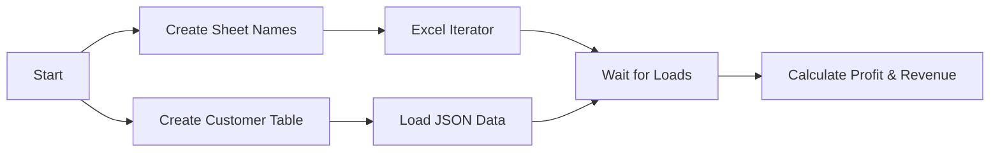

# GreenWave Technologies - Business Analytics Demo

[](https://www.matillion.com/)
[]()

## Overview

This mini project demonstrates a **complete end-to-end business analytics workflow** using Matillion Data Productivity Cloud. The GreenWave Technologies demo showcases how to process multiple data sources (Excel files and JSON data) to generate business insights including profit and revenue analysis.

## 🎯 Business Scenario

**GreenWave Technologies** needs to analyze their business performance by:
- Loading product catalog, orders, and customer data from Excel files
- Processing complex customer account information from JSON
- Calculating profit and revenue metrics
- Generating monthly summaries by customer account and product

## 📊 Data Sources

### 1. **Excel Files** (S3: `s3://devrel.matillion.com/solutions/GreenWave/store_lite.xlsx`)
- **ITEMS**: Product catalog with pricing and cost information
- **ORDERS**: Order headers with customer relationships and dates  
- **ORDER_ITEMS**: Detailed line items with quantities per order

### 2. **JSON Data** (S3: `s3://devrel.matillion.com/solutions/GreenWave/customer_accounts.json`)
- **Customer Accounts**: Nested JSON structure containing customer IDs and account names

## 🏗️ Pipeline Architecture

### Main Orchestration Pipeline
**File**: `GreenWave Technologies Demo.orch.yaml`



#### Key Components:
1. **Parallel Data Loading**:
   - Dynamic Excel worksheet processing using Table Iterator
   - JSON customer data loading to staging table

2. **Iterator Pattern**: 
   - Processes multiple Excel worksheets dynamically
   - Uses worksheet names from `GW_SHEET_NAMES` table

3. **Synchronization**: 
   - `AND` component ensures all data loads complete before transformation

### Transformation Pipelines

#### 1. **Worksheet Names Setup** (`trns_project.tran.yaml`)
- Creates reference table with Excel worksheet names
- Enables dynamic processing of multiple sheets

#### 2. **Business Analytics** (`Calculate Profit and Revenue.tran.yaml`)
- **Complex Data Integration**:
  - Joins orders, items, customers, and order details
  - Handles nested JSON extraction for customer data
  - Type conversions for proper data analysis

- **Business Calculations**:
  - Profit: `(PRICE - COST) * QUANTITY`
  - Revenue: `PRICE * QUANTITY`
  - Monthly groupings: `TRUNCATE(ORDER_DATE, 'mm')`

- **Data Aggregation**:
  - Groups by customer account, item, and order month
  - Sums profit and revenue metrics

## 📊 Output

**Target Table**: `GW_PROFIT_BY_ACCOUNT`

| Column | Description |
|--------|-------------|
| `ACCOUNT_NAME` | Customer account name |
| `ITEM_NAME` | Product name |
| `ORDER_MONTH` | Order month (truncated date) |
| `PROFIT` | Total profit for the account/item/month |
| `REVENUE` | Total revenue for the account/item/month |

## 🚀 Key Learning Concepts

### **Advanced Orchestration Patterns**
- ✅ **Dynamic Data Processing**: Table Iterator for Excel worksheets
- ✅ **Parallel Execution**: Loading multiple data sources simultaneously
- ✅ **Synchronization**: Using AND component to coordinate workflows
- ✅ **Variable Usage**: Dynamic worksheet name handling

### **Complex Data Transformations**
- ✅ **Nested JSON Processing**: Extract customer data from variant columns
- ✅ **Multi-table Joins**: Integrating 4+ data sources
- ✅ **Type Conversions**: Ensuring proper data types for calculations
- ✅ **Business Logic**: Profit/revenue calculation formulas
- ✅ **Data Aggregation**: Grouping and summarizing business metrics

### **Data Integration Techniques**
- ✅ **Excel File Processing**: Dynamic worksheet handling
- ✅ **JSON Data Extraction**: Flattening nested structures
- ✅ **S3 Data Loading**: Cloud storage integration
- ✅ **Snowflake Integration**: Data warehouse operations

## 🗺️ Data Flow Diagram

```
Excel Files (S3)
⬇️
[Table Iterator] → [Excel Query] → GW_ITEMS, GW_ORDERS, GW_ORDER_ITEMS
                                             ⬇️
JSON Customer Data (S3)                    [Type Conversions]
⬇️
[S3 Load] → GW_CUSTOMER_ACCOUNTS → [Extract Nested] → Customer Info
                                             ⬇️
                                          [Join All Data]
                                             ⬇️
                                       [Calculate Metrics]
                                             ⬇️
                                        [Aggregate Results]
                                             ⬇️
                                     GW_PROFIT_BY_ACCOUNT
```

## 🏁 Running the Demo

### Prerequisites
- Matillion Data Productivity Cloud access
- Snowflake data warehouse connection
- Access to sample data files (publicly available)

### Execution Steps

1. **Run the Main Orchestration**:
   ```yaml
   Pipeline: mini_project/GreenWave Technologies Demo.orch.yaml
   ```

2. **Monitor Progress**:
   - Watch parallel data loading from Excel and JSON sources
   - Observe iterator processing multiple worksheets
   - View final transformation creating business metrics

3. **Review Results**:
   ```sql
   SELECT * FROM MATILLION.STAGE.GW_PROFIT_BY_ACCOUNT 
   ORDER BY ORDER_MONTH, ACCOUNT_NAME;
   ```

## 📚 Advanced Features Demonstrated

- **🔄 Iterator Patterns**: Dynamic processing based on metadata tables
- **🧮 Parallel Processing**: Concurrent data loading with synchronization
- **🌐 Nested Data Handling**: Complex JSON structure extraction
- **📊 Business Intelligence**: Real-world profit/revenue calculations
- **🔗 Data Integration**: Multi-format data source consolidation
- **⚙️ Type Safety**: Proper data type handling throughout pipeline

## 📈 Business Value

This demo shows how to:
- **Automate** complex data processing workflows
- **Integrate** disparate data sources (Excel + JSON)
- **Calculate** key business metrics automatically
- **Scale** processing to handle multiple data files
- **Maintain** data quality through type conversions and validation

---

**🌟 This mini project represents a production-ready pattern for business analytics workflows using Matillion Data Productivity Cloud.**

[Back to Main Project](../README.md)